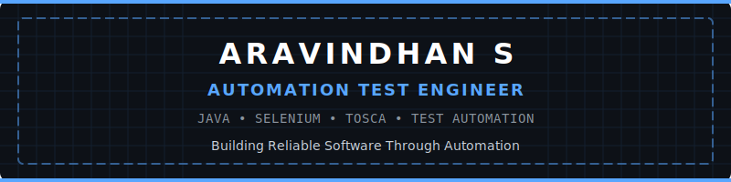

<!-- Banner -->
<div align="center">
  
</div>

<!-- Hero Section -->
<h1 align="center">Aravindhan S</h1>
<p align="center">
  <strong>Automation Test Engineer | Java Developer | Quality Engineering</strong>
</p>
<p align="center">
  Building scalable automation solutions with Java, Selenium, and Tosca.
</p>

<!-- Navigation -->
<p align="center">
  <a href="#about">About</a> •
  <a href="#featured-projects">Projects</a> •
  <a href="#technology-stack">Skills</a> •
  <a href="#learning-timeline">Experience</a> •
  <a href="#github-dashboard">GitHub</a> •
  <a href="#contact">Contact</a>
</p>

---

<h2 id="about">📝 About</h2>
<p>Automation Test Engineer with a strong interest in software quality, automation frameworks, and Java application development.</p>
<p>I enjoy creating maintainable automation solutions, learning modern testing practices, and building projects that solve real-world problems.</p>

<h2 id="quick-information">⚡ Quick Information</h2>

| | |
| :--- | :--- |
| **Current Role** | Automation Test Engineer |
| **Company** | Larsen & Toubro |
| **Primary Language** | Java |
| **Specialization** | Automation Testing |
| **Current Learning** | Selenium, Tosca, API Testing |
| **Open Source** | Learning & Contributing |

<h2 id="technology-stack">🛠️ Technology Stack</h2>
<p align="left">
  <a href="https://skillicons.dev">
    
  </a>
</p>

<h2 id="current-focus">🎯 Current Focus</h2>

- **Building**: Enterprise Selenium Framework
- **Learning**: Advanced Tosca
- **Improving**: API Automation
- **Exploring**: CI/CD Integration
- **Practicing**: Java Collections
- **Next Goal**: Playwright

<h2 id="featured-projects">🚀 Featured Projects</h2>

<table width="100%">
  <tr>
    <td width="50%">
      <h3>🏢 Employee Management System</h3>
      <p>Desktop Application</p>
      <p><code>Java</code> <code>MySQL</code> <code>CRUD</code> <code>JDBC</code></p>
    </td>
    <td width="50%">
      <h3>🧪 Selenium Automation Framework</h3>
      <p>Page Object Model</p>
      <p><code>TestNG</code> <code>Maven</code> <code>Extent Reports</code> <code>Cross Browser</code></p>
    </td>
  </tr>
  <tr>
    <td width="50%">
      <h3>📚 Java Practice Repository</h3>
      <p>200+ Java Programs</p>
      <p><code>Collections</code> <code>OOP</code> <code>Exception Handling</code></p>
    </td>
    <td width="50%">
      <h3>🌐 API Testing</h3>
      <p>REST API</p>
      <p><code>Postman</code> <code>Automation</code> <code>Collections</code></p>
    </td>
  </tr>
</table>

<h2 id="github-dashboard">📊 GitHub Dashboard</h2>

<div align="center">
  
  
</div>

<h2 id="learning-timeline">🛣️ Learning Timeline</h2>

```text
2025: Internship
  ↓
2026: Automation Test Engineer
  ↓
Current: Java | Selenium | Tosca
  ↓
Next: Playwright | Docker | AWS
  ↓
Future: SDET
```

<h2 id="certifications">📜 Certifications</h2>
<ul>
  <li>Larsen & Toubro Internship</li>
  <li>Automation Training</li>
  <!-- <li>Java Certifications (Coming Soon)</li> -->
  <!-- <li>Tosca Certifications (Coming Soon)</li> -->
</ul>

<h2 id="repository-categories">📂 Repository Categories</h2>
<p>
  <a href="#"><kbd>Automation</kbd></a>
  <a href="#"><kbd>Java</kbd></a>
  <a href="#"><kbd>API Testing</kbd></a>
  <a href="#"><kbd>SQL</kbd></a>
  <a href="#"><kbd>Projects</kbd></a>
  <a href="#"><kbd>Learning</kbd></a>
</p>

<h2 id="fun-section">☕ Fun Section</h2>

```text
Coffee Consumed             ██████████
Debugging                   ████████████████
Learning                    ██████████████████████
Writing Automation Scripts  ██████████████████
```

<h2 id="quote">💡 Quote</h2>
<blockquote>
  "Every successful release begins with reliable testing and continuous improvement."
</blockquote>

<h2 id="contact">📫 Contact</h2>
<p>
  <a href="https://github.com/aravindh2003s"></a>
  <a href="https://linkedin.com/in/aravindh2003s"></a>
  <a href="mailto:your.email@example.com"></a>
</p>

<p align="center">
  <i>Thanks for visiting my profile. Feel free to explore my repositories, connect with me on LinkedIn, or follow my automation journey.</i>
</p>
