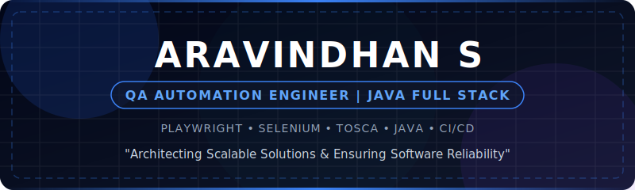

<!-- Banner -->
<picture>
  <source media="(prefers-color-scheme: dark)" srcset="assets/banner-dark.svg">
  <source media="(prefers-color-scheme: light)" srcset="assets/banner-light.svg">
  
</picture>

<!-- Typing Animation -->

  <a href="#about-me">About Me</a> •
  <a href="#skills">Skills</a> •
  <a href="#projects">Projects</a> •
  <a href="#stats">Stats & Activity</a> •
  <a href="#contact">Contact</a>

---

  <h2>👋 About Me</h2>
  <table width="100%">
    <tr>
      <td width="60%">
        
I am a <strong>Java Full Stack Developer</strong> and <strong>Automation Test Engineer</strong> currently working at Larsen & Toubro. I specialize in building robust enterprise applications and architecting scalable automation frameworks that ensure software reliability.

        
My dual expertise in development and quality engineering allows me to approach problems holistically—writing clean, maintainable code while anticipating potential edge cases.

        
<strong>🌱 Currently Exploring:</strong> Advanced CI/CD pipelines, Docker, and Playwright.

      </td>
      <td width="40%" align="center">
        
      </td>
    </tr>
  </table>

  <h2>🚀 Technical Arsenal</h2>
   
  
  

    <strong>Languages & Frameworks</strong> 
    
  

  
  

    <strong>Automation & Quality Engineering</strong> 
    
  

  
  

    <strong>Tools & Environments</strong> 
    
  

  <h2>🔥 Featured Work</h2>
  
  <table width="100%">
    <tr>
      <td width="50%">
        <h3 align="center">🏢 Employee Management System</h3>
        
<i>Full Stack Java Desktop Application</i>

        
A comprehensive system to manage employee records featuring a secure backend, responsive UI, and robust database architecture.

        

          
          
          
        

      </td>
      <td width="50%">
        <h3 align="center">🧪 Enterprise Automation Framework</h3>
        
<i>End-to-end Testing Architecture</i>

        
A scalable Selenium-based framework implementing the Page Object Model (POM), data-driven testing, and rich Extent reports.

        

          
          
          
        

      </td>
    </tr>
    <tr>
      <td width="50%">
        <h3 align="center">🌐 API Testing Suite</h3>
        
<i>Backend Reliability Testing</i>

        
Extensive REST API collections with automated assertions, continuous execution via Newman, and structured environment variables.

        

          
          
        

      </td>
      <td width="50%">
        <h3 align="center">📚 Automation Learning Journey</h3>
        
<i>Knowledge Base & Tutorials</i>

        
An organized repository of my continuous learning journey, featuring code snippets, best practices, and interview preparations.

        

          
          
        

      </td>
    </tr>
  </table>

  <h2>📈 GitHub Metrics & Activity</h2>
  
  

    
    
  

  
   
  <h3 align="center">🐍 Contribution Graph Animation</h3>
  

    <picture>
      <source media="(prefers-color-scheme: dark)" srcset="https://raw.githubusercontent.com/aravindh2003s/aravindh2003s/output/github-contribution-grid-snake-dark.svg">
      <source media="(prefers-color-scheme: light)" srcset="https://raw.githubusercontent.com/aravindh2003s/aravindh2003s/output/github-contribution-grid-snake.svg">
      
    </picture>
  

  <h2>📬 Let's Connect</h2>
  

    <i>"Quality is not an act, it is a habit."</i>
  

  

    
    
    
  

